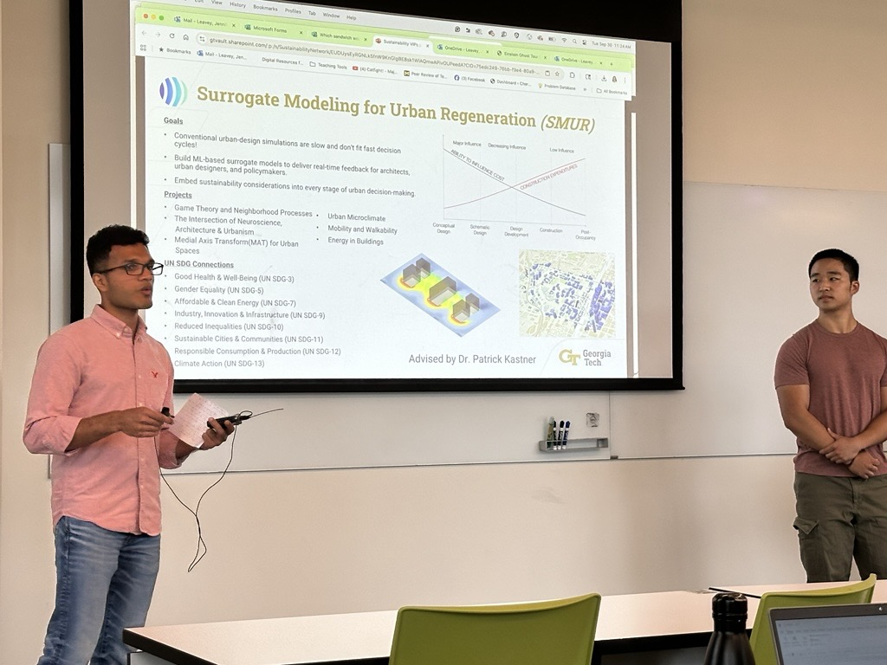
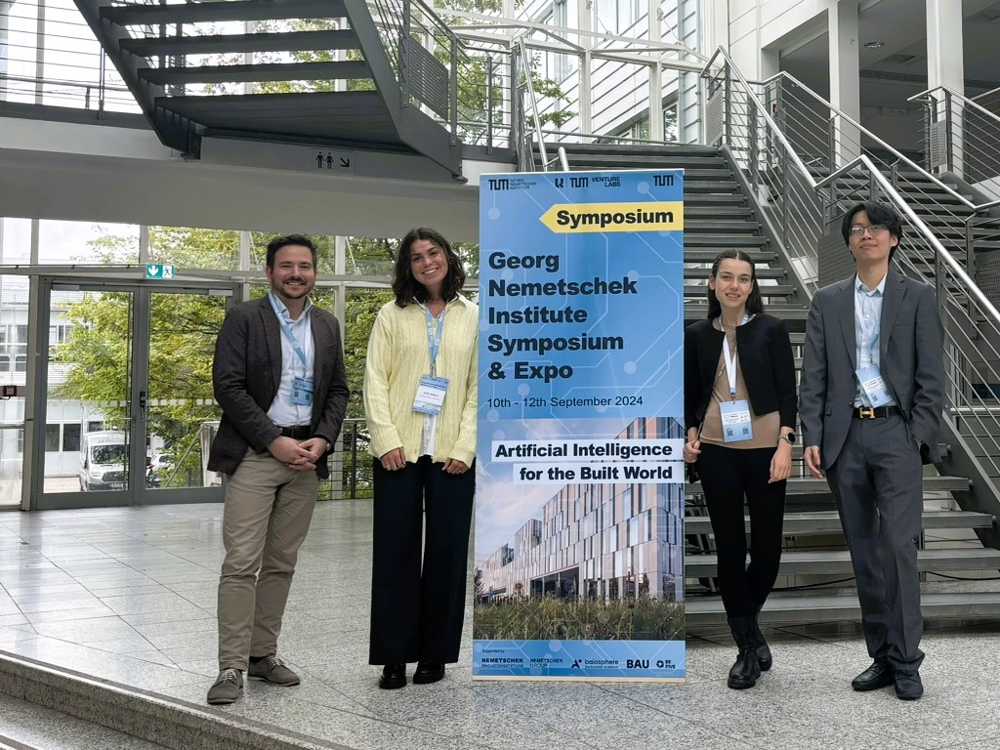
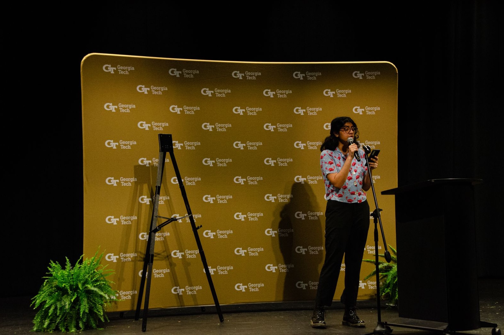

# Outreach & Conferences

## Fall 2025

<figure markdown="span">
  
  <figcaption>
    Joseph Aerathu and Matthew Lim representing our VIP at the Fall 2025 <a href="https://research.gatech.edu/georgia-tech-sustainability-network" target="_blank" rel="noopener noreferrer" aria-label="Sustainability Network Meeting (opens in a new tab)">Sustainability Network Meeting</a>.
  </figcaption>
</figure>

## Summer 2025

<figure markdown="span">
  
  <figcaption>
    Justin Xu presenting his contributions to the <a href="https://vip-smur.github.io/25sp-mponc/" target="_blank" rel="noopener noreferrer" aria-label="MPONC (opens in a new tab)">MPONC</a> project as part of the <a href="https://ugresearch.isye.gatech.edu/research-awards-programs/summer-scholars-program" target="_blank" rel="noopener noreferrer" aria-label="ISyE Summer Scholars Program (opens in a new tab)">ISyE Summer Scholars Program</a>.
  </figcaption>
</figure>

## Fall 2024

<figure markdown="span">
  
  <figcaption><a href="https://sustainableurbansystems.com/news/announcement_25/" target="_blank" rel="noopener noreferrer" aria-label="Georgia Undergraduate Research Conference 2024 in Oxford, GA (opens in a new tab)">Georgia Undergraduate Research Conference 2024 in Oxford, GA</a>

  Anubha Mahajan, Jessica Hernandez, Jiayi Li, Joseph Mathew Aerathu, Sharmista Debnath, Kiana-Karla Layam,  Han-Syun Shih, Hang Xu, and Patrick Kastner. Photo credits: Han-Syun Shih</figcaption>
</figure>

<figure markdown="span">
  
  <figcaption><a href="https://sustainableurbansystems.com/news/announcement_24/" target="_blank" rel="noopener noreferrer" aria-label="GNI Symposium on AI for the Built World in Munich, Germany (opens in a new tab)">GNI Symposium on AI for the Built World in Munich, Germany</a>. 

  Ze Yu Jiang, Sofia Mujica, Silvia Vangelova, and Patrick Kastner</figcaption>
</figure>

## Spring 2024

<figure markdown="span">
  
  <figcaption>Anubha Mahajan representing VIP-SMUR at the Spring 24 BBISS Sustainability Showcase.</figcaption>
</figure>
