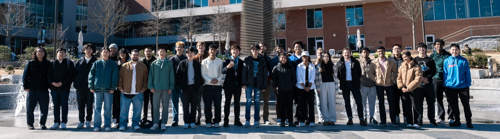

---
hide:
  - toc
---

# Spring 2025

<figure markdown="span">

  <figcaption>SMUR 2025 Team Picture</figcaption>

</figure>

| Name                | Seniority | Major                  | School | # Semesters | GitHub Handle                                 | Topic Area                                                   |
| ------------------- | --------- | ---------------------- | ------ | ----------- | --------------------------------------------- | ------------------------------------------------------------ |
| Joseph M. Aerathu   | Masters   | Architecture (HPB)     | ARCH   | 2           | [jma1999][gh-jma1999]                         | [Energy‑In‑Buildings][topic-energy-in-buildings]             |
| Matthew Lim         | Sophomore | Computer Science       | SCS    | 2           | [mlim70][gh-mlim70]                           | [MPONC][topic-mponc]                                         |
| Marcelo Álvarez     | Masters   | Architecture (DC)      | ARCH   | 2           | [alvarezdmarch][gh-alvarezdmarch]             | [Microclimate‑UMCF][topic-microclimate-umcf]                 |
| Changda Ma          | Masters   | Architecture           | ARCH   | 2           | [changdama][gh-changdama]                     | [Neuroarchitecture][topic-neuroarchitecture]                 |
| Anubha Mahajan      | Senior    | Computer Science       | SCS    | 3           | [amahajan68][gh-amahajan68]                   | [Energy‑In‑Buildings][topic-energy-in-buildings]             |
| Jessica Hernandez   | Masters   | Computer Science       | SCS    | 2           | [jhernandez312][gh-jhernandez312]             | [Energy‑In‑Buildings][topic-energy-in-buildings]             |
| Han‑Syun Shih       | Masters   | Architecture (HBP)     | ARCH   | 2           | [Benjaminhansyun][gh-benjaminhansyun]         | [Microclimate‑LSTM‑Kriging][topic-microclimate-lstm-kriging] |
| Thanasarn Changnawa | PhD       | Architecture           | ARCH   | 2           | [Thanasarn‑Changnawa][gh-thanasarn-changnawa] | [Microclimate‑LSTM‑Kriging][topic-microclimate-lstm-kriging] |
| Hang Xu             | PhD       | Architecture (HBP)     | ARCH   | 2           | [HangXXXu][gh-hangxxxu]                       | [Energy‑In‑Buildings][topic-energy-in-buildings]             |
| Justin Xu           | Sophomore | Computer Science       | SCS    | 1           | [JXU037][gh-jxu037]                           | [MPONC][topic-mponc]                                         |
| Jiayi Li            | Junior    | Architecture           | ARCH   | 2           | [jli3307][gh-jli3307]                         | [Energy‑In‑Buildings][topic-energy-in-buildings]             |
| Marcellus English   | Sophomore | Civil Engineering      | CEE    | 1           | [mcenglish][gh-mcenglish]                     | [Microclimate‑UMCF][topic-microclimate-umcf]                 |
| Kavya Lalith        | Sophomore | Computer Engineering   | ECE    | 1           | [kavya‑oop][gh-kavya-oop]                     | [Energy‑In‑Buildings][topic-energy-in-buildings]             |
| Krish Gupta         | Junior    | Civil Engineering      | CEE    | 2           | [krishgupta‑CE][gh-krishgupta-ce]             | [Microclimate‑LSTM‑Kriging][topic-microclimate-lstm-kriging] |
| Victor Wang         | Freshman  | Industrial Engineering | ISYE   | 1           | [vdwang][gh-vdwang]                           | [Microclimate‑UMCF][topic-microclimate-umcf]                 |
| Catherine Wallis    | Senior    | Architecture           | ARCH   | 1           | [cgwallis][gh-cgwallis]                       | [Neuroarchitecture][topic-neuroarchitecture]                 |
| Atharva Beesen      | Junior    | Computer Science       | SCS    | 2           | [AtharvaBeesen][gh-atharvabeesen]             | [Mobility‑PEI][topic-mobility-pei]                           |
| Joshua Cohen        | Senior    | Civil Engineering      | CEE    | 2           | [paradoxwalk][gh-paradoxwalk]                 | [Mobility‑PEI][topic-mobility-pei]                           |
| Mason Dewitt        | Freshman  | Computer Engineering   | ECE    | 1           | [Masonrd][gh-masonrd]                         | [Mobility‑PEI][topic-mobility-pei]                           |
| Johnny Chen         | Freshman  | Computer Science       | SCS    | 1           | [jxchen21][gh-jxchen21]                       | [Energy‑In‑Buildings][topic-energy-in-buildings]             |
| Yupeng Tang         | Masters   | Computer Science       | SCS    | 1           | [yupengtang][gh-yupengtang]                   | [Microclimate‑LSTM‑Kriging][topic-microclimate-lstm-kriging] |
| Dayeon Song         | Freshman  | Industrial Engineering | ISYE   | 1           | [daytss][gh-daytss]                           | [Microclimate‑LSTM‑Kriging][topic-microclimate-lstm-kriging] |
| Gonzalo Vegas       | PhD       | Architecture           | ARCH   | 3           | [gvegasol][gh-gvegasol]                       | [Microclimate‑UMCF][topic-microclimate-umcf]                 |
| Sina Rahimi         | PhD       | Architectural Science  | ARCH   | 2           | [sinarahimi][gh-sinarahimi]                   | [Microclimate‑UMCF][topic-microclimate-umcf]                 |
| Ze Yu Jiang         | Junior    | Computer Science       | SCS    | 3           | [zeyujiang8800][gh-zeyujiang8800]             | [Microclimate‑LSTM‑Kriging][topic-microclimate-lstm-kriging] |
| Nicholas Stone      | Junior    | Computer Science       | SCS    | 1           | [nstone213][gh-nstone213]                     | [Mobility‑PEI][topic-mobility-pei]                           |
| Devam Mondal        | Junior    | Computer Science       | SCS    | 2           | [Dodesimo][gh-dodesimo]                       | [MPONC][topic-mponc]                                         |
| Nithish Sabapathy   | Junior    | Computer Science       | SCS    | 1           | [nithish101][gh-nithish101]                   | [MPONC][topic-mponc]                                         |
| Shivam Patel        | Junior    | Computer Science       | SCS    | 3           | [FlippyShivam][gh-flippyshivam]               | [Energy‑In‑Buildings][topic-energy-in-buildings]             |
| Yao Xiao            | Sophomore | Computer Science       | SCS    | 1           | [Xyrro][gh-xyrro]                             | [Mobility‑PEI][topic-mobility-pei]                           |
| Yichao Shi          | PhD       | Architecture (DC)      | ARCH   | 2           | [SHIyichao98][gh-shiyichao98]                 | [Energy‑In‑Buildings][topic-energy-in-buildings]             |

[gh-jma1999]:                   https://github.com/jma1999
[gh-mlim70]:                     https://github.com/mlim70
[gh-alvarezdmarch]:              https://github.com/alvarezdmarch
[gh-changdama]:                  https://github.com/changdama
[gh-amahajan68]:                 https://github.com/amahajan68
[gh-jhernandez312]:              https://github.com/jhernandez312
[gh-benjaminhansyun]:            https://github.com/hshih38
[gh-thanasarn-changnawa]:        https://github.com/Thanasarn-Changnawa
[gh-hangxxxu]:                   https://github.com/HangXXXu
[gh-jxu037]:                     https://github.com/JXU037
[gh-jli3307]:                    https://github.com/jli3307
[gh-mcenglish]:                  https://github.com/mcenglish
[gh-kavya-oop]:                  https://github.com/kavya-oop
[gh-krishgupta-ce]:              https://github.com/krishgupta-CE
[gh-vdwang]:                     https://github.com/vdwang
[gh-cgwallis]:                   https://github.com/cgwallis
[gh-atharvabeesen]:              https://github.com/AtharvaBeesen
[gh-paradoxwalk]:                https://github.com/paradoxwalk
[gh-masonrd]:                    https://github.com/Masonrd
[gh-jxchen21]:                   https://github.com/jxchen21
[gh-yupengtang]:                 https://github.com/yupengtang
[gh-daytss]:                     https://github.com/daytss
[gh-gvegasol]:                   https://github.com/gvegasol
[gh-sinarahimi]:                 https://github.com/sinarhm
[gh-zeyujiang8800]:              https://github.com/zeyujiang8800
[gh-nstone213]:                  https://github.com/nstone213
[gh-dodesimo]:                   https://github.com/Dodesimo
[gh-nithish101]:                 https://github.com/nithish101
[gh-flippyshivam]:               https://github.com/FlippyShivam
[gh-xyrro]:                      https://github.com/Xyrro
[gh-shiyichao98]:                https://github.com/SHIyichao98

[topic-energy-in-buildings]:         ../../25sp-energyinbuildings
[topic-mponc]:                       ../../25sp-mponc
[topic-microclimate-umcf]:           ../../25sp-microclimate-umcf
[topic-neuroarchitecture]:           ../../25sp-neuroarchitecture
[topic-microclimate-lstm-kriging]:   ../../25sp-microclimate-lstm-kriging
[topic-mobility-pei]:                ../../25sp-mobility-pei
