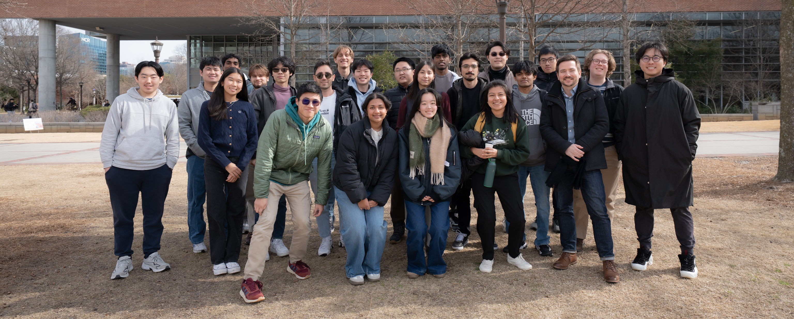

---
hide:
  - toc
---

# Spring 2026

**Class Lead:** Patrick Kastner

**Co-Instructor (WindComfort-ML):** Ilker Karadag

| Name                | Seniority | Major                            | School | # Semesters | GitHub Handle                                   | Topic Area                                              |
| ------------------- | --------- | -------------------------------- | ------ | ----------- | ----------------------------------------------- | ------------------------------------------------------- |
| Mason Dewitt        | Sophomore | Computer Engineering             | ECE    | 3           | [Masonrd][gh-masonrd]                           | [Mobility-PEI][topic-mobility]                          |
| Matthew Lim         | Junior    | Computer Science                 | SCS    | 4           | [mlim70][gh-mlim70]                             | [MPONC][topic-mponc]                                    |
| Tianxiang Sheng     | Masters   | Architecture, Architecture (HBP) | ARCH   | 1           | [Shawn-TianxiangSheng][gh-shawn-tianxiangsheng] | [Hardware + IoT][topic-hardware-iot]                    |
| Gonzalo Vegas       | Masters   | Architecture                     | ARCH   | 5           | [gvegasol][gh-gvegasol]                         | [Medial Axis][topic-medialaxis]                         |
| Alec Cheng          | Masters   | Computer Science                 | SCS    | 1           | [alec-y-cheng][gh-alec-y-cheng]                 | [WindComfort-ML][topic-windcomfort-ml]                  |
| Anjali Mathews      | Sophomore | Civil Engineering                | CEE    | 1           | [amathews38][gh-amathews38]                     | [Microclimate-Outdoor+][topic-microclimate-outdoorplus] |
| Lucy Chai           | Freshman  | Industrial Engineering           | ISYE   | 2           | [lucymchai][gh-lucymchai]                       | [Mobility-PEI][topic-mobility]                          |
| Ian Baracskay       | Senior    | Computer Engineering             | ECE    | 2           | [ianBaracskay][gh-ianbaracskay]                 | [MPONC][topic-mponc]                                    |
| Kavya Lalith        | Senior    | Computer Engineering             | ECE    | 3           | [kavya-oop][gh-kavya-oop]                       | [Hardware + IoT][topic-hardware-iot]                    |
| Jessica Hernandez   | Masters   | Computer Science                 | SCS    | 4           | [jhernandez312][gh-jhernandez312]               | [Medial Axis][topic-medialaxis]                         |
| Nishanth Giridharan | Junior    | Industrial Engineering           | ISYE   | 2           | [NishanthG05][gh-nishanthg05]                   | [WindComfort-ML][topic-windcomfort-ml]                  |
| Marcelo Alvarez     | Masters   | Architecture (DC)                | ARCH   | 4           | [alvarezdmarch][gh-alvarezdmarch]               | [Microclimate-Outdoor+][topic-microclimate-outdoorplus] |
| Katherine Davis     | Sophomore | Industrial Engineering           | ISYE   | 2           | [katherine-el-davis][gh-katherine-el-davis]     | [Mobility-PEI][topic-mobility]                          |
| Justin Xu           | Junior    | Computer Science                 | SCS    | 3           | [JXU037][gh-jxu037]                             | [MPONC][topic-mponc]                                    |
| Jason Tran          | Junior    | Computer Science                 | SCS    | 2           | [jtran86][gh-jtran86]                           | [Hardware + IoT][topic-hardware-iot]                    |
| Han Syun Shih       | Masters   | Architecture (HBP)               | ARCH   | 4           | [BenjaminHansyun][gh-benjaminhansyun]           | [Medial Axis][topic-medialaxis]                         |
| Kevin Zhang         | Junior    | Computer Science                 | SCS    | 1           | [kevinzhxng][gh-kevinzhxng]                     | [WindComfort-ML][topic-windcomfort-ml]                  |
| Aiko Hayashi        | Sophomore | Architecture                     | ARCH   | 2           | [Annetotoro][gh-annetotoro]                     | [Microclimate-Outdoor+][topic-microclimate-outdoorplus] |
| Tristin Shestag     | Junior    | Industrial Engineering           | ISYE   | 1           | [tshestag][gh-tshestag]                         | [Mobility-PEI][topic-mobility]                          |
| Sujai Jitta         | Sophomore | Computer Science                 | SCS    | 1           | [sjitta][gh-sjitta]                             | [MPONC][topic-mponc]                                    |
| Rohak Agarwal       | Junior    | Computer Science                 | SCS    | 1           | [ragarwal46][gh-ragarwal46]                     | [Medial Axis][topic-medialaxis]                         |
| Ze Yu Jiang         | Masters   | Computer Science                 | SCS    | 5           | [zeyujiang8800][gh-zeyujiang8800]               | [WindComfort-ML][topic-windcomfort-ml]                  |
| Ai Hoang            | Freshman  | Architecture                     | ARCH   | 1           | [naihoang][gh-naihoang]                         | [Microclimate-Outdoor+][topic-microclimate-outdoorplus] |
| Nithish Sabapathy   | Sophomore | Computer Science                 | SCS    | 3           | [nithish101][gh-nithish101]                     | [MPONC][topic-mponc]                                    |
| Yupeng Tang         | Masters   | Computer Science, CSE            | SCS    | 3           | [yupengtang][gh-yupengtang]                     | Special Project                                         |

[gh-masonrd]: https://github.com/Masonrd
[gh-mlim70]: https://github.com/mlim70
[gh-karadagi]: https://github.com/karadagi
[gh-shawn-tianxiangsheng]: https://github.com/Shawn-TianxiangSheng
[gh-gvegasol]: https://github.com/gvegasol
[gh-alec-y-cheng]: https://github.com/alec-y-cheng
[gh-alvarezdmarch]: https://github.com/alvarezdmarch
[gh-amathews38]: https://github.com/amathews38
[gh-lucymchai]: https://github.com/lucymchai
[gh-ianbaracskay]: https://github.com/ianBaracskay
[gh-kavya-oop]: https://github.com/kavya-oop
[gh-jhernandez312]: https://github.com/jhernandez312
[gh-nishanthg05]: https://github.com/NishanthG05
[gh-katherine-el-davis]: https://github.com/katherine-el-davis
[gh-jxu037]: https://github.com/JXU037
[gh-jtran86]: https://github.com/jtran86
[gh-benjaminhansyun]: https://github.com/BenjaminHansyun
[gh-kevinzhxng]: https://github.com/kevinzhxng
[gh-annetotoro]: https://github.com/Annetotoro
[gh-tshestag]: https://github.com/tshestag
[gh-sjitta]: https://github.com/sjitta
[gh-ragarwal46]: https://github.com/ragarwal46
[gh-zeyujiang8800]: https://github.com/zeyujiang8800
[gh-naihoang]: https://github.com/naihoang
[gh-nithish101]: https://github.com/nithish101
[gh-yupengtang]: https://github.com/yupengtang
[topic-windcomfort-ml]: ../../26sp-windcomfort-ml
[topic-microclimate-outdoorplus]: ../../26sp-microclimate-outdoorplus
[topic-mobility]: ../../26sp-mobility
[topic-mponc]: ../../26sp-mponc
[topic-hardware-iot]: ../../26sp-hardware-iot
[topic-medialaxis]: ../../26sp-medialaxis
